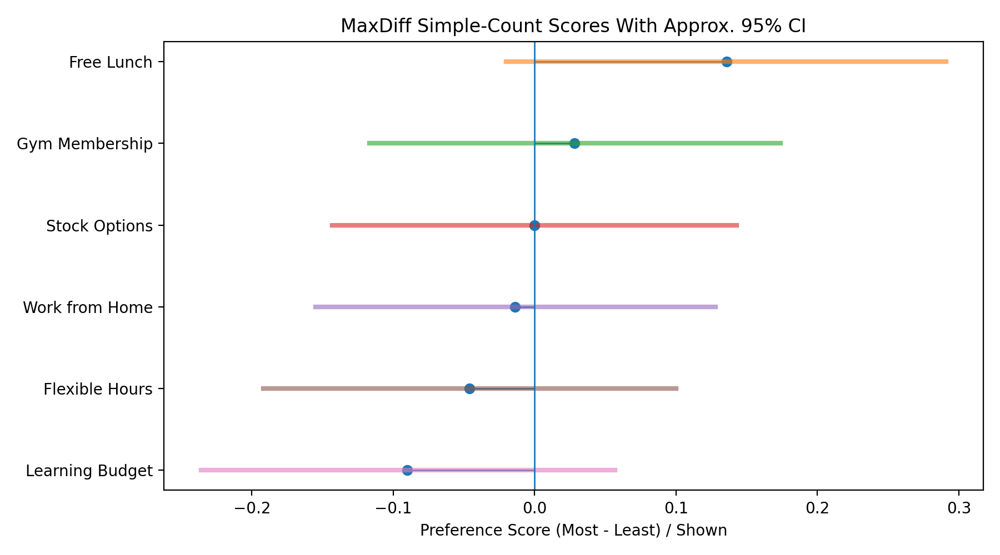
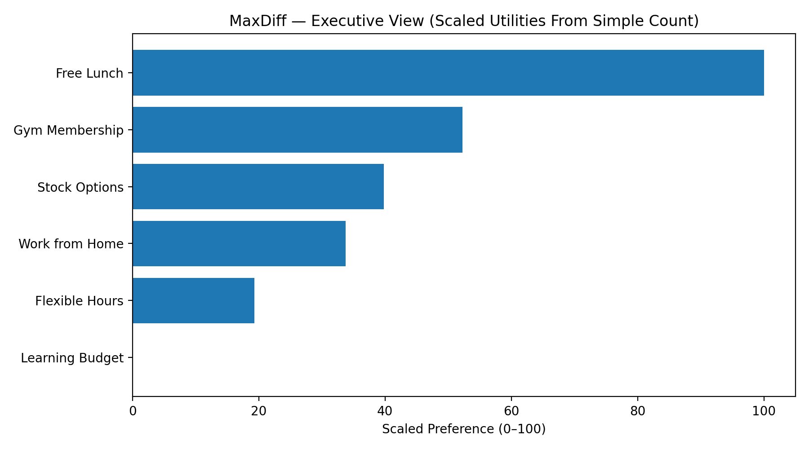

# MaxDiff Scaling — Python Implementation Series

This repository hosts a **series of Python implementations** for **MaxDiff Scaling (Maximum Difference Scaling)**.  
Each article in the series introduces one methodology, its theory, and a corresponding Python script with examples and visualizations.

The goal: provide **self-contained, end-to-end code** for learning and applying MaxDiff in real-world contexts such as **Retail, People Analytics, Marketing, and more**.

---

## 📌 What is MaxDiff?

MaxDiff (also known as Best-Worst Scaling) is a survey-based technique where respondents are shown sets of items and asked:
- Which is **most important**?
- Which is **least important**?

Compared to traditional rating scales (1–5 stars, Likert):
- ✅ Forces **trade-offs**
- ✅ Reduces **rating biases**
- ✅ Produces clear, **rank-ordered preferences**

---

## 📂 Repository Structure

Each article in the series is accompanied by a standalone Python script:

- **Article 1** → `1-max_diff_scaling.py`  
  - Implements the **Simple Count method**
  - Simulates toy survey responses
  - Computes preference scores
  - Estimates ~95% confidence intervals
  - Generates two plots:
    1. **CI Lollipop plot** (scores with confidence intervals)
    2. **Executive bar chart** (scaled 0–100 utilities)
  - Saves results as CSV + PNGs into `outputs/`

Future articles will be added here, e.g.:
- `maxdiff_logit.py` → Logistic regression approach  
- `maxdiff_hb.py` → Hierarchical Bayes approach  

---

## ⚙️ Installation

Clone the repo and install dependencies:

```bash
git clone https://github.com/srishti2906/maxdiff-scaling.git
cd maxdiff-scaling

# (optional) create a virtual environment
python -m venv .venv
source .venv/bin/activate

# install dependencies
pip install -r requirements.txt
````

Minimal dependencies:

```text
numpy
pandas
matplotlib
```

---

## ▶️ Usage

Run a specific article script, e.g. for **Article 1**:

```bash
python max_diff_scaling.py
```

Options (with defaults):

```bash
--out-dir              Directory to save results (default: ./outputs)
--respondents          Number of respondents to simulate (default: 20)
--sets-per-respondent  Number of sets per respondent (default: 5)
--items-per-set        Number of items shown per set (default: 4)
```

Example:

```bash
python max_diff_scaling.py --respondents 50 --sets-per-respondent 8
```

---

## 📊 Example Outputs (Article 1)

**1️⃣ MaxDiff Simple-Count Scores With Approx. 95% CI**
Lollipop plot showing net-preference scores and ~95% confidence intervals.



**2️⃣ MaxDiff — Executive View (Scaled Utilities From Simple Count)**
Scaled 0–100 bar chart, easier to communicate priorities to leadership.



---

## 🔮 Roadmap

This repo will grow as the series progresses:

* Article 1 → Simple Count ✅
* Article 2 → 🔜
* Article 3 → 🔜
* Article 4 → 🔜
* Article 5 → 🔜

---

## 📝 License

MIT License. See [LICENSE](LICENSE) for details.

---

